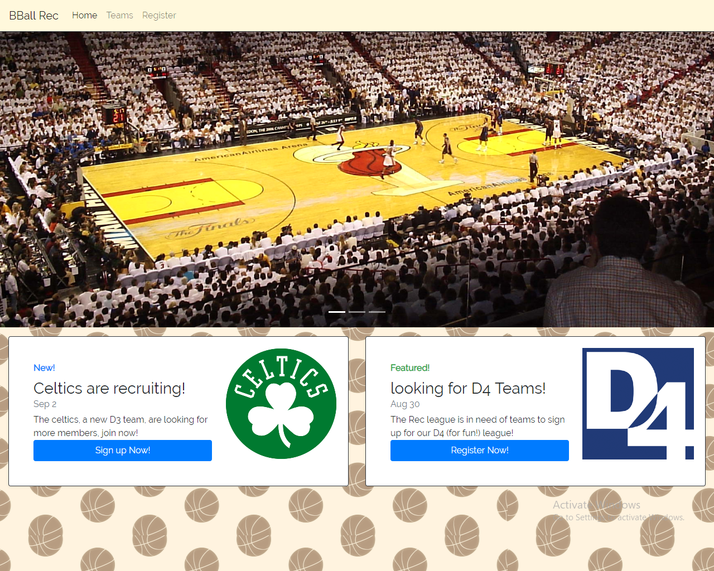

# BasketballRecLeague

## About

The purpose of this project is to demonstrate a combination of programming strategies we've learned over the duration of the bootcamp. The app will be basketball themed, and it will display a list of leagues, teams, and members registered with the site. Users will also be able to register, edit, and delete new teams or members.

## Tech

The webpage will be written in HTML, CSS, and JavaScript. Additionally, the page will utilize a server file to dynamically pull data from a local JSON file.

## How To

To launch the server, navigate to the parent folder BasketballRecLeague in your file directory. Drag that folder into your command line and change to that directory. Once there, perform a 'node server.js' to initialize the webserver. Then, enter 'http://localhost:8081/' in your browser's address bar.

## Website

